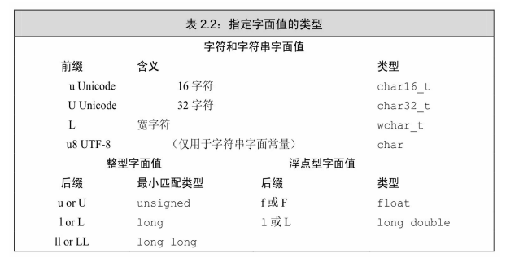
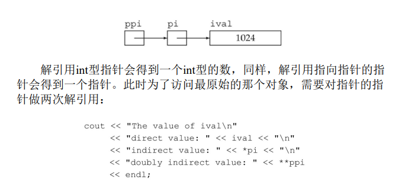

## Chapter 2 变量和基本类型

### 2.1 基本内置类型

C++定义了一套包括算术类型（arithmetic type）和空类型（void） 在内的基本数据类型。其中算术类型包含了字符、整型数、布尔值和浮点数，当函数不返回任何值时使用空类型作为返回类型。

#### 算术类型

算术类型分成两种： **整型(integral type)**和**浮点型** 并且某一类型所占的比特数不同，它所能表示的 数据范围也不一样 


- 基本的字符类型 是char，一个char的空间应确保可以存放机器基本字符集中任意字符对 应的数字值。也就是说，一个char的大小和一个机器字节一样。 

- C++语言规定一个int至少和一个short一样大，一个long至少和一个 int一样大，一个long long至少和一个long一样大。其中，数据类型long long是在C++11中新定义的。 
- 大多数机器的字节由8 比特构成，字则由32或64比特构成，也就是4或8字节。 
- 浮点型可表示单精度、双精度和扩展精度值，通常，float以1个字（32比特）来表示，double以2个字（64比特）来表 示，long double以3或4个字（96或128比特）来表示。 
- 整型可以划分为**带符号的 (signed)**和**无符号的(unsigned)**两种。 类型int、short、long和long long都是带符号的，通过在这些类型名前添加**unsigned**就可以得到无符号类型,带符号类型可以表示正数、 负数或0，无符号类型则仅能表示大于等于0的值。 
- 字符型被分为了三种：char、signed char和 unsigned char。特别需要注意的是：类型char和类型signed char并不一 样。尽管字符型有三种，但是字符的表现形式却只有两种：带符号的和 无符号的。类型char实际上会表现为上述两种形式中的一种，具体是哪 种由编译器决定。 

##### 选择类型

- 当明确知晓数值不可能为负时，选用无符号类型。 
- 使用**int**执行整数运算。在实际应用中，**short**常常显得太小而**long**一般和int有一样 的尺寸。如果你的数值超过了int的表示范围，选用**long long**。 
- 在算术表达式中不要使用char或bool，只有在存放字符或布尔值时才使用它们。 因为类型char在一些机器上是有符号的，而在另一些机器上又是无符号的，所以如果 使用char进行运算特别容易出问题。如果你需要使用一个不大的整数，那么明确指定 它的类型是**signed char**或者**unsigned char**。 
- 执行浮点数运算选用double，这是因为float通常精度不够而且双精度浮点数和单 精度浮点数的计算代价相差无几。事实上，对于某些机器来说，双精度运算甚至比单 精度还快。long double提供的精度在一般情况下是没有必要的，况且它带来的运行时 消耗也不容忽视 

#### 类型转换

- 当我们把一个布尔值赋给非布尔类型时，初始值为false则结果为 0，初始值为true则结果为1。 
- 当我们把一个浮点数赋给整数类型时，进行了近似处理。结果值 将仅保留浮点数中小数点之前的部分。 
- 当我们把一个整数值赋给浮点类型时，小数部分记为0。如果该整 数所占的空间超过了浮点类型的容量，精度可能有损失。 
- 当我们赋给无符号类型一个超出它表示范围的值时，结果是初始 值对无符号类型表示数值总数取模后的余数。例如，8比特大小的 unsigned char可以表示0至255区间内的值，如果我们赋了一个区间以外 的值，则实际的结果是该值对256取模后所得的余数。因此，把-1赋给8 比特大小的unsigned char所得的结果是255。
- 当我们赋给带符号类型一个超出它表示范围的值时，结果是未定 义的（undefined）。此时，程序可能继续工作、可能崩溃，也可能生成 垃圾数据。 
- 当一个算术表达式中**既有无符号数又有int值 时，那个int值就会转换成无符号数**。把int转换成无符号数的过程和把int 直接赋给无符号变量一样

```cpp
#include<iostream>
int main(){
	unsigned u = 10;
	int i = -42;
	std::cout << i + i << std::endl; // output 84
	std::cout << u + i << std::endl; // output 4294967264
	return 0; 
}
```

得出结论：**切勿混用带符号类型和无符号类型** 

-  当从无符号数中减去一个值时，不管这个值是不是无符号数，我们 都必须确保结果**不能是一个负值** 

```cpp
#include<iostream>
int main(){
	unsigned u1 = 42, u2 = 10;
	std::cout << u1 - u2 << std::endl; //Output 32
	std::cout << u2 - u1 << std::endl; //Output 4294967264  after moding value
	return 0; 
}
```

#### 字面值常量(literal)

##### 整型和浮点型字面值

- 我们可以将整型字面值写作十进制数、八进制数或十六进制数的形式，我们可以将整型字面值写作十进制数、八进制数或十六进制数的形式； 以0开头的整数代表八进制数，以0x或0X开头的代表十六进制  
- 尽管整型字面值可以存储在带符号数据类型中，但严格来说，十进 制字面值不会是负数。如果我们使用了一个形如-42的负十进制字面 值，那个负号并不在字面值之内，**它的作用仅仅是对字面值取负值而已**。 
- 浮点型字面值表现为一个小数或以科学计数法表示的指数，其中指 数部分用E或e标识： `3.14159 3.14159E0  0. 0e0 .001`默认的，浮点型字面值是一个double 

##### 字符型字面值

- 由单引号括起来的一个字符称为char型字面值，双引号括起来的零 个或多个字符则构成字符串型字面值。 

```cpp
'a' // 字符字面值
"Hello World!" //字符串字面值
```

- 编译器在每个字符串的结尾处添加 一个空字符（′\0′），因此，字符串字面值的实际长度要比它的内容多 1,如果两个字符串字面值位置紧邻且仅由空格、缩进和换行符分隔， 则它们实际上是一个整体。当书写的字符串字面值比较长，写在一行里 不太合适时，就可以采取分开书写的方式： 

```cpp
// 分多行书写的字符串字面值
std::cout<< "a really, really long string literal"
			"that spans two lines" << std::endl;
```

- 在C++语言中有特殊含义的字符（单引号、双引号、问号、反斜线）。 在这些情况下需要用到转义序列（escape sequence） 转义序列均以反 斜线作为开始，C++语言规定的转义序列包括： 


- 通过添加表中所列的前缀和后缀，可以改变整型、浮点型和 字符型字面值的默认类型。 



##### 布尔字面值和指针字面值 

true和false是布尔类型的字面值： 

```cpp
bool test = false;
```

nullptr是指针字面值

### 2.2 变量

#### 变量定义

变量定义的基本形式是：首先是类型说明符（**type specifier**），随 后紧跟由一个或多个变量名组成的列表，其中变量名以逗号分隔，最后 以分号结束。 

**对象是具有某种数据类型的内存空间** 

**初始化不是赋值，初始化的含义是创建变量时赋予其一个初始值，而赋值的含义 是把对象的当前值擦除，而以一个新值来替代。**  

##### 列表初始化 

- C++11新标准 :用花括号来初始化变量 

```cpp
int units_sold = 0;
int units_sold(0);

//新特性
int units_sold = {0};  
int units_sold{0};
```

当用于内置类型的变量时， 这种初始化形式有一个重要特点：如果 我们使用列表初始化且初始值存在丢失信息的风险，则编译器将报错 

##### 默认初始化 

- 如果是内置类型的变量未被显式初始化，它的值由定义的位置决定。 定义于任何函数体之外的变量被初始化为0 ，一种例外情况是，定义在函数体内部的内置类型变量将不被 初始化（**uninitialized**）
- 一个未被初始化的内置类型变量的值是未定义 的，如果试图拷贝或以其他形式访问此类值将 引发错误。 
- 绝大多数类都支持无须显式初始化而定义对象，这样的类提供了一 个合适的默认值。例如 

```cpp
std::string empty; // empty 非显式的初始化为一个空串
```

- 一些类要求每个对象都显式初始化，此时如果创建了一个该类的对 象而未对其做明确的初始化操作，将引发错误。 

#### 变量声名和定义的关系

为了允许把程序拆分成多个逻辑部分来编写，C++语言支持分离式 编译（separate compilation）机制，该机制允许将程序分割为若干个文 件，每个文件可被独立编译。 

- 为了允许把程序拆分成多个逻辑部分来编写，C++语言支持分离式 编译（separate compilation）机制，该机制允许将程序分割为若干个文 件，每个文件可被独立编译。 
- 变量声明规定了变量的类型和名字，在这一点上定义与之相同。但 是除此之外，定义还申请存储空间，也可能会为变量赋一个初始值。
- 如果想声明一个变量而非定义它，就在变量名前添加关键字 extern，而且不要显式地初始化变量 
- **extern语句如果包含初始值就不再是声明，而变成定义了** 

```cpp
extern int i; // 声名i而非定义i
int j; // 声名并定义j
extern double pi = 3.1416; // 定义
```


##### 关键概念：静态类型 

C++是一种静态类型（**statically typed**）语言，其含义是在编译阶段检查类型。其 中，检查类型的过程称为类型检查（type checking）。 

我们已经知道，对象的类型决定了对象所能参与的运算。在C++语言中，编译器 负责检查数据类型是否支持要执行的运算，如果试图执行类型不支持的运算，编译器 将报错并且不会生成可执行文件。 

程序越复杂，静态类型检查越有助于发现问题。然而，前提是编译器必须知道每 一个实体对象的类型，这就要求我们在使用某个变量之前必须声明其类型。 

#### 标识符

- C++的标识符（**identifier**）由字母、数字和下画线组成，其中必须 以字母或下画线开头，标识符的长度没有限制，但是对大小写字母敏感 
- 用户自定义的标识符中不 能连续出现两个下画线，也不能以下画线紧连大写字母开头。此外，定 义在函数体外的标识符不能以下画线开头。 

##### 变量命名规范

- 标识符要能体现实际含义 
- 变量名一般用小写字母 
- 用户自定义的类名一般以大写字母开头，如Sales_item 
- 如果标识符由多个单词组成，则单词间应有明显区分，如 **student_loan**或**studentLoan**，不要使用studentloan。 


#### 名字的作用域

不论是在程序的什么位置，使用到的每个名字都会指向一个特定的 实体：变量、函数、类型等。然而，同一个名字如果出现在程序的不同 位置，也可能指向的是不同实体 

- 作用域（**scope**）是程序的一部分，在其中名字有其特定的含义。 C++语言中大多数作用域都以花括号分隔 
- 名字main定义于所有花括号之外，它和其他大多数定义在函数体之 外的名字一样拥有全局作用域（**global scope**） 

##### 嵌套的作用域

- 作用域能彼此包含，被包含（或者说被嵌套）的作用域称为内层作 用域**（inner scope）**，包含着别的作用域的作用域称为外层作用域 **（outer scope）** 
- 作用域中一旦声明了某个名字，它所嵌套着的所有作用域中都能访 问该名字。同时，允许在内层作用域中重新定义外层作用域已有的名字 ，并且内层作用域的变量将覆盖掉外层作用域的变量
- 如果函数有可能用到某全局变量，则**不宜再定义一个同名的局部变量** 

### 2.3 复合类型 

- C++语 言有几种复合类型，本章将介绍其中的两种：引用和指针 

- 一条声明语句由 一个基本数据类型（base type）和紧随其后的一个声明符（declarator） 列表组成 

#### 引用

引用（**reference**）为对象起了另外一个名字，引用类型引用（**refers to**）另外一种类型。通过将声明符写成&d的形式来定义引用类型，其中 d是声明的变量名  

- 定义引用时，程序把引用和它的初始值绑定（**bind**）在一起，而不是将初始值拷贝给引用。 

##### 引用即别名

- 引用并非对象，相反的，它只是为一个已经存在的对象所起的另外一个名字。
- **引用只能被引用一次，并且中途无法更改** 
- 获取引用的值，实际上是获取了与引用绑定的对象的值 
- 因为引用本身不是一个对象，所以不能定义引用的引用 

##### 引用的定义

- 引用只能绑定在对象上，而不能与字面值或某个表达式的计算结果绑定在 一起 

```cpp
int &refVal4 = 10;				// 错误： 引用类型的初始必须是一个对象，而不是一个字面值
double dval = 3.14;
int &refVal5 = dval; 			// 错误： 引用类型的初始值必须是int 型对象
```

#### 指针

指针（**pointer**）是“指向（point to）”另外一种类型的复合类型。与引用类似，指针也实现了对其他对象的间接访问。然而指针与引用相比 又有很多不同点。其一，**指针本身就是一个对象**，允许对指针赋值和拷贝，**而且在指针的生命周期内它可以先后指向几个不同的对象**。其二， 指针无须在定义时赋初值。和其他内置类型一样，在块作用域内定义的 指针如果没有被初始化，也将拥有一个不确定的值。

- 定义指针类型的方法将声明符写成`*d`的形式 

##### 获取对象的地址

- 指针存放某个对象的地址，要想获取该地址，需要使用取地址符 （操作符**&**） 

指针值应属于下面四种状态之一：

- 指向一个对象 
- 指向紧邻对象所占空间的下一个位置。 
- 空指针，意味着指针没有指向任何对象。 
- 无效指针，也就是上述情况之外的其他值 

**试图拷贝或以其他方式访问无效指针的值都将引发错误** 

##### 利用指针访问对象

如果指针指向了一个对象，则允许使用解引用符（操作符＊）来访 问该对象 

##### 关键概念：某些符号有多重含义 


##### 空指针

**空指针（null pointer）**不指向任何对象，在试图使用一个指针之前 代码可以首先检查它是否为空，得到空指针最直接的办法就是用字面值**nullptr**来初始化指针，这也 是C++11新标准刚刚引入的一种方法，**nullptr**是一种特殊类型的字面 值，它可以被转换成任意其他的指针类型。另 一种办法就是通过将指针初始化为字面值0来生成空指针。 

过去的程序还会用到一个名为NULL的**预处理变量（preprocessor variable）**来给指针赋值，这个变量在头文件cstdlib中定义，它的值就是 0 。

**在新标准下，现在 的C++程序最好使用nullptr** 

##### 赋值和指针

- 一旦定义了引用，就无法令其再绑定到另外的对象，之后每次使用这个引用都是访问它最初绑定的那个对象 

- 有时候要想搞清楚一条赋值语句到底是改变了指针的值还是改变了 指针所指对象的值不太容易，**最好的办法就是记住赋值永远改变的是等 号左侧的对象** 

##### 其他指针操作

- 如果指针的值 是0，条件取false 
- 对于两个类型相同的合法指针，可以用相等操作符（==）或不相等 操作符（!=）来比较它们，比较的结果是布尔类型。如果两个指针存 放的地址值相同，则它们相等 
- 一个指针 指向某对象，同时另一个指针指向另外对象的下一地址，此时也有可能 出现这两个指针值相同的情况，即指针相等 

##### void＊ 指针 

**void＊**是一种特殊的指针类型，可用于存放任意对象的地址。一个 **void＊**指针存放着一个地址，这一点和其他指针类似。不同的是，我们 对该地址中到底是个什么类型的对象并不了解 。

#### 理解复合类型的声明

在同一条定义语句中，虽然基本数据类型只有一个，但是声明 符的形式却可以不同

#####  指向指针的指针 

一般来说，声明符中修饰符的个数并没有限制,允许把指针的地址再 存放到另一个指针当中 

```cpp
int ival = 1024;
int *pi = &ival;
int **ppi = &pi;
```

此处pi是指向int型数的指针，而ppi是指向int型指针的指针 



### 2.4 const限定符

满足随时警惕防止程序 一不小心改变了这个值这一要求，可以用关键字const对变量的类型加以限定。

因为const对象一旦创建后其值就不能再改变，**所以const对象必须 初始化** 

##### 初始化和const

与非const类 型所能参与的操作相比，const类型的对象能完成其中大部分，但也不是 所有的操作都适合。主要的限制就是只能在const类型的对象上执行不改 变其内容的操作 

##### 默认状态下，const对象仅在文件内有效 

我们希望只在一个文件中定义const，而在其他多 个文件中声明并使用它的时候我们可以对于const变量不管是声明还是定义都添加extern关 键字，这样只需定义一次就可以了 

#### const的引用

可以把引用绑定到const对象上，就像绑定到其他对象上一样，我们 称之为对常量的引用（reference to const）。与普通引用不同的是，对 常量的引用不能被用作修改它所绑定的对象

##### 初始化和对const的引用 

引用的类型必须与其所引用对象的类型一 致，但是有两个例外。第一种例外情况就是在初始化常量引用时允许用 任意表达式作为初始值，只要该表达式的结果能转换成引用的类型即可。 

```cpp
double dval = 3.14;
const int &ri = dval;
```

此处`ri `引用了一个`int`类型的整数，但dval却 是一个双精度浮点数而非整数。因此为了确保让ri绑定一个整数，编译 器把上述代码变成了如下形式： 

```cpp
const int temp = dval;
const int &ri = temp;
```

在这种情况下，ri绑定了一个临时量**（temporary）**对象 

##### 对const的引用可能引用一个并非const的对象 

常量引用仅对引用可参与的操作做出了限定，对于引 用的对象本身是不是一个常量未作限定。因为对象也可能是个非常量， 所以允许通过其他途径改变它的值： 

```cpp
int i = 42;
int &r1 = i;
const int &r2 = i;
r1 = 0;
r2 = 0;
```

r2绑定（非常量）整数i是合法的行为。然而，不允许通过r2修改i 的值 

#### 指针和const

- 指向常量的指针**（pointer to const）**不能用 于改变其所指对象的值。要想存放常量对象的地址，只能使用指向常量的指针 。
- 指针的类型必须与其所指对象的类型一 致，但是有例外：允许令一个指向常量的指针指 向一个非常量对象 即指向常量的指针也没有规定其所指的对象必须是一个常量 

##### const 指针

常量指针（**const pointer**）必须初始化，而且一旦初始 化完成，则它的值（也就是存放在指针中的那个地址）就不能再改变 了。把`＊`放在const关键字之前用以说明指针是一个常量，这样的书写形 式隐含着一层意味，**即不变的是指针本身的值而非指向的那个值** 

指针本身是一个常量并不意味着不能通过指针修改其所指对象的 值，能否这样做完全依赖于所指对象的类型。

#### 顶层const

指针本身是一个对象，它又可以指向另外一个对象。因 此，指针本身是不是常量以及指针所指的是不是一个常量就是两个相互 独立的问题。用名词**顶层const（top-level const）**表示指针本身是个常 量，而用**名词底层const（low-level const）**表示指针所指的对象是一个 常量。 

- 当执行对象的拷贝操作时，常量是顶层const还是底层const区别明 显。其中，顶层const不受什么影响 
- 执行拷贝操作并不会改变被拷贝对象的值，拷入和拷出的对 象是否是常量都没什么影响 
- 底层const的限制却不能忽视。当执行对象的拷贝操作 时，拷入和拷出的对象必须具有相同的底层const资格，或者两个对象的 数据类型必须能够转换 

#### constexpr 和常量表达式

**常量表达式（const expression）**是指值不会改变并且在编译过程就 能得到计算结果的表达式。 

##### constexpr变量

C++11新标准规定，允许将变量声明为constexpr类型以便由编译器 来验证变量的值是否是一个常量表达式 

```cpp
constexpr int sz = size() // 只有当size是一个constexpr函数时才是一条正确的声明语句
```

##### 字面值类型

尽管指针和引用都能定义成constexpr，但它们的初始值却受到严格 限制。一个constexpr指针的初始值必须是nullptr或者0，或者是存储于某 个固定地址中的对象。 

函数体内定义的变量一般来说并非 存放在固定地址中，因此constexpr指针不能指向这样的变量。相反的， 定义于所有函数体之外的对象其地址固定不变，能用来初始化constexpr 指针。 

##### 指针和constexpr

在constexpr声明中如果定义了一个指针，**限定符 constexpr仅对指针有效**，与指针所指的对象无关 

```cpp
const int *p = nullptr; // p 是一个指向整型常量的指针
constexpr int *q = nullptr;  //q是一个指向整数的常量指针
```

**constexpr指针既可以指向常量也可以指向一 个非常量** 


 