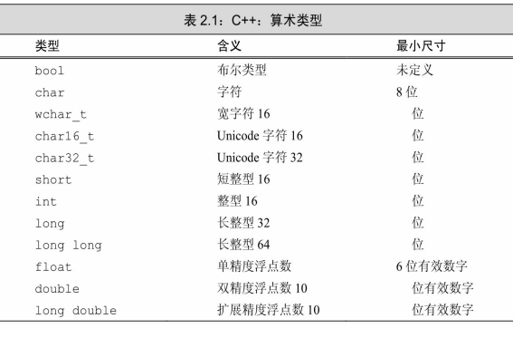

## Chapter 2 变量和基本类型

### 2.1 基本内置类型

C++定义了一套包括算术类型（arithmetic type）和空类型（void） 在内的基本数据类型。其中算术类型包含了字符、整型数、布尔值和浮点数，当函数不返回任何值时使用空类型作为返回类型。

#### 算术类型

算术类型分成两种： **整型(integral type)**和**浮点型** 并且某一类型所占的比特数不同，它所能表示的 数据范围也不一样 



- 基本的字符类型 是char，一个char的空间应确保可以存放机器基本字符集中任意字符对 应的数字值。也就是说，一个char的大小和一个机器字节一样。 

- C++语言规定一个int至少和一个short一样大，一个long至少和一个 int一样大，一个long long至少和一个long一样大。其中，数据类型long long是在C++11中新定义的。 
- 大多数机器的字节由8 比特构成，字则由32或64比特构成，也就是4或8字节。 
- 浮点型可表示单精度、双精度和扩展精度值，通常，float以1个字（32比特）来表示，double以2个字（64比特）来表 示，long double以3或4个字（96或128比特）来表示。 
- 整型可以划分为**带符号的 (signed)**和**无符号的(unsigned)**两种。 类型int、short、long和long long都是带符号的，通过在这些类型名前添加**unsigned**就可以得到无符号类型,带符号类型可以表示正数、 负数或0，无符号类型则仅能表示大于等于0的值。 
- 字符型被分为了三种：char、signed char和 unsigned char。特别需要注意的是：类型char和类型signed char并不一 样。尽管字符型有三种，但是字符的表现形式却只有两种：带符号的和 无符号的。类型char实际上会表现为上述两种形式中的一种，具体是哪 种由编译器决定。 

##### 选择类型

- 当明确知晓数值不可能为负时，选用无符号类型。 
- 使用**int**执行整数运算。在实际应用中，**short**常常显得太小而**long**一般和int有一样 的尺寸。如果你的数值超过了int的表示范围，选用**long long**。 
- 在算术表达式中不要使用char或bool，只有在存放字符或布尔值时才使用它们。 因为类型char在一些机器上是有符号的，而在另一些机器上又是无符号的，所以如果 使用char进行运算特别容易出问题。如果你需要使用一个不大的整数，那么明确指定 它的类型是**signed char**或者**unsigned char**。 
- 执行浮点数运算选用double，这是因为float通常精度不够而且双精度浮点数和单 精度浮点数的计算代价相差无几。事实上，对于某些机器来说，双精度运算甚至比单 精度还快。long double提供的精度在一般情况下是没有必要的，况且它带来的运行时 消耗也不容忽视 

#### 类型转换

- 当我们把一个布尔值赋给非布尔类型时，初始值为false则结果为 0，初始值为true则结果为1。 
- 当我们把一个浮点数赋给整数类型时，进行了近似处理。结果值 将仅保留浮点数中小数点之前的部分。 
- 当我们把一个整数值赋给浮点类型时，小数部分记为0。如果该整 数所占的空间超过了浮点类型的容量，精度可能有损失。 
- 当我们赋给无符号类型一个超出它表示范围的值时，结果是初始 值对无符号类型表示数值总数取模后的余数。例如，8比特大小的 unsigned char可以表示0至255区间内的值，如果我们赋了一个区间以外 的值，则实际的结果是该值对256取模后所得的余数。因此，把-1赋给8 比特大小的unsigned char所得的结果是255。
- 当我们赋给带符号类型一个超出它表示范围的值时，结果是未定 义的（undefined）。此时，程序可能继续工作、可能崩溃，也可能生成 垃圾数据。 
- 当一个算术表达式中**既有无符号数又有int值 时，那个int值就会转换成无符号数**。把int转换成无符号数的过程和把int 直接赋给无符号变量一样

```cpp
#include<iostream>
int main(){
	unsigned u = 10;
	int i = -42;
	std::cout << i + i << std::endl; // output 84
	std::cout << u + i << std::endl; // output 4294967264
	return 0; 
}
```

得出结论：**切勿混用带符号类型和无符号类型** 

-  当从无符号数中减去一个值时，不管这个值是不是无符号数，我们 都必须确保结果**不能是一个负值** 

```cpp
#include<iostream>
int main(){
	unsigned u1 = 42, u2 = 10;
	std::cout << u1 - u2 << std::endl; //Output 32
	std::cout << u2 - u1 << std::endl; //Output 4294967264  after moding value
	return 0; 
}
```

#### 字面值常量(literal)

##### 整型和浮点型字面值

- 我们可以将整型字面值写作十进制数、八进制数或十六进制数的形式，我们可以将整型字面值写作十进制数、八进制数或十六进制数的形 式 
- 尽管整型字面值可以存储在带符号数据类型中，但严格来说，十进 制字面值不会是负数。如果我们使用了一个形如-42的负十进制字面 值，那个负号并不在字面值之内，**它的作用仅仅是对字面值取负值而已**。 
- 浮点型字面值表现为一个小数或以科学计数法表示的指数，其中指 数部分用E或e标识： `3.14159 3.14159E0  0. 0e0 .001`


-  

- 

- 

  

   